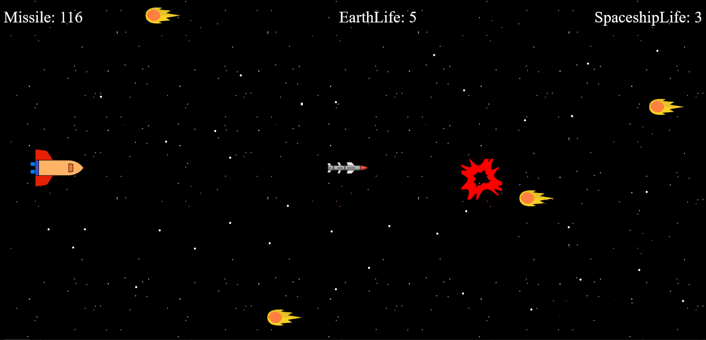

# space_impact
Space game where you travel in a space-ship and destroy meteors with missiles to save humanity.

# [Click here to Play the game](https://ppml38.github.io/space_impact/)

## Story line
Scientists have warned that a cluster of meteors is on earth's orbiting path and they are going to hit earth soon.    

All nations' governments have discussed and chosen you to destroy all of them, with a spaceship equiped with enough missiles.     

You, the brave man/woman, onboard the spaceship and going to complete this mission.

## Stats
* Number of meteors in the cluster to destroy: 100
* Number of missiles available in spaceship: 120
* Maximum number of meteor-hits spaceship can withstand: 3
* Maximum number of meteor-hits earth can withstand: 5

Destroy all the meteors to win.

## Controls
Up arrow - Move spaceship to top     
Down arrow - Move spaceship to bottom      
Space - Launch missile     

## Demo
